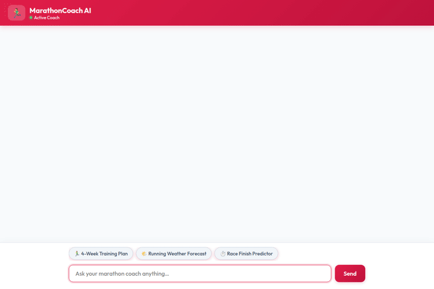

# MarathonCoach AI 🏃💨

**MarathonCoach AI** is an intelligent, multi-tool marathon and athletic training assistant powered by **Google Gemini** on **Vertex AI**, built with the **Agent Development Kit (ADK)** and featuring structured **A2UI (Agent-to-User Interface)** surface rendering.



---

## 🌟 Implemented Features & Capabilities

MarathonCoach AI implements the following production features and Google Cloud service integrations:

### 1. 🧠 Long-Term Memory (Vertex AI Memory Bank)
- **Session Memory Persistence**: Integrates `PreloadMemoryTool` and `add_session_to_memory` callbacks to automatically extract, store, and recall key runner facts (target race dates, past PRs, injury history, preferred rest days) across multi-turn sessions.

### 2. 🗄️ Database Workout Logging (Google Cloud Firestore)
- **Workout History Lookup (`get_workout_logs`)**: Queries the Firestore `workout_logs` collection to fetch recent running history by runner ID.
- **Workout Logging (`log_workout`)**: Persists new workout entries (date, distance, duration, pace, workout type, notes) directly to Firestore.
- **Workout Log Management (`update_workout_logs`)**: Modifies or deletes existing Firestore workout log documents.

### 3. 🌤️ Live Weather Forecasts (Open-Meteo API)
- **Running Weather Forecast (`get_running_weather`)**: Fetches real-time temperature, wind speed, humidity, and 1-7 day future weather forecasts for any city, returning personalized outdoor running coaching recommendations (hydration, clothing layers, pacing adjustments).

### 4. 🎨 Motivational Media Synthesis (Vertex AI Image Gen & Cloud Storage)
- **Image Generation (`generate_motivational_graphic`)**: Generates custom high-quality marathon graphics using `gemini-3.1-flash-lite-image`.
- **Cloud Storage Persistence (`google.cloud.storage`)**: Uploads generated images directly to a Google Cloud Storage bucket and generates public HTTPS URLs for inline display.

### 5. 📊 Algorithmic Running Tools
- **Multi-Week Training Plan Builder (`generate_training_plan`)**: Generates customized step-by-step training schedules featuring safe 10% weekly volume caps, recovery cutback weeks, and race tapers.
- **Race Finish Predictor (`predict_race_finish_time`)**: Uses Riegel's fatigue formula ($T_2 = T_1 \times (D_2 / D_1)^{1.06}$) to predict finish times and target paces based on recent time trials or race performances.
- **Training Progress Calculator (`calculate_progress`)**: Computes weekly volume progression targets, build phase week estimates, and fatigue readiness indices.

### 6. 💻 Sandboxed Code Execution & Structured A2UI
- **Agent Engine Sandbox Code Executor**: Runs sandboxed Python calculations inside Google Cloud Reasoning Engine / Agent Engine.
- **A2UI Surface Rendering (`a2ui_utils.py`)**: Renders structured UI components (Cards, Columns, Rows, Text, Images) for frontend rendering alongside natural text replies.

---

## 📋 Planned (Not Yet Implemented) Features

The following features were outlined in initial design concepts but are **not yet implemented** in the codebase:
- **Vector Search / RAG PDF Handbooks**: Semantic search over marathon training PDF documents using Vertex AI Vector Search. *(Status: Planned, not yet implemented)*.
- **Wearable Device Integration**: Automated sync with Garmin / Strava APIs. *(Status: Planned, not yet implemented)*.

---

## 📁 Repository Structure

```
marathon-coach-ai/
├── app/                        # Core Agent Logic
│   ├── agent.py                # Main ADK Agent definition, tools, and system prompt
│   ├── a2ui_utils.py           # A2UI callback and surface fallback renderer
│   └── fast_api_app.py         # FastAPI backend server wrapper
├── frontend/                   # Web Chat Frontend Application
│   ├── main.py                 # FastAPI service serving static UI and /chat endpoint
│   └── static/
│       ├── index.html          # Chat interface HTML template
│       ├── style.css           # Glassmorphism styling and themes
│       └── app.js              # Frontend chat logic & A2UI renderer
├── demo.gif                    # Animated demonstration preview
├── agents-cli-manifest.yaml    # agents-cli project manifest
└── pyproject.toml              # Python dependencies specification
```

---

## 🚀 Setup & Local Execution

### Prerequisites

Ensure you have the following installed on your machine:
- **Python 3.10+**
- **uv**: Fast Python package installer (`pip install uv` or `curl -sSf https://astral.sh/uv/install.sh | sh`)
- **google-agents-cli**: `uv tool install google-agents-cli`
- **Google Cloud SDK**: Configured with `gcloud auth application-default login`

### 1. Environment Configuration

Create a `.env` file in the root directory with your GCP configuration:

```bash
GOOGLE_CLOUD_PROJECT="your-gcp-project-id"
GOOGLE_CLOUD_LOCATION="us-east1"
```

### 2. Install Dependencies

Install all required Python packages using `uv`:

```bash
uv sync
```

### 3. Run Agent Playground (Local Development)

Launch the interactive ADK Agent Playground server locally:

```bash
agents-cli playground
```

### 4. Run Frontend Server Locally

To start the frontend chat server locally:

```bash
uv run python -m uvicorn frontend.main:app --reload --port 8080
```

Open your browser to the local server port to interact with MarathonCoach AI.

---

## 🧪 Testing & Evaluation

Run unit and integration tests:

```bash
uv run pytest tests/unit tests/integration
```

Run agent evaluation suites using `agents-cli`:

```bash
agents-cli eval generate
agents-cli eval grade
```

---

## 📄 License

Apache License 2.0. Copyright 2026 Google LLC.
